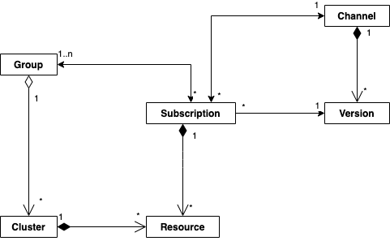

# satcon-client

## Usage

Although the purpose of the library is to insulate users to some extent from the details of the SatCon API, an understanding of key concepts and, in some cases, actual API details is required to use it successfully.  Users new to Satellite Config and/or Razee (the IBM-developed open source tooling that is the core of Satellite Config) may want to visit these links to gain familiarity:

- [Satellite Config API Schema](https://github.com/razee-io/Razeedash-api/tree/master/app/apollo/schema) - can help with understanding entity details and relationships
- [Razee.io docs](https://github.com/razee-io/Razee/blob/master/README.md) - primarily useful for users wanting to understand more of what's under the covers

### Key objects in Satellite Config

There are six primary entity classes in SatCon, at least from a user perspective.  These are:

1. **Cluster** - represents an actual kubernetes cluster to be managed via SatCon
1. **Group** - clusters to be managed similarly are collected into groups to facilitate organized and simplified distribution of resources
1. **Channel** - a channel collects a set of configurations which can then be distributed to cluster groups
1. **Version** - within a channel, a version represents a configuration (which can itself contain one or more kubernetes objects to be created/configured, e.g. a single Version could encapsulate both a Pod and a ConfigMap) which can be distributed via a subscription
1. **Subscription** - a subscription associates a cluster group with a version and the owning channel, so that the SatCon agent will then know to pull that configuration down and apply it to every cluster within that group
1. **Resource** - configurations applied to clusters produce resources, which are essentially just that - representations of kubernetes resources which have been deployed to the cluster(s)

This diagram provides an overview of the relationships between the various entities:

### SatCon Workflow

A typical SatCon workflow might proceed roughly as follows:

1. **Register a cluster to SatCon.**  This makes the cluster known to SatCon, and the API call will return the URL for a kube yaml file which can be applied to the actual cluster.  This yaml will deploy and configure the SatCon (razee) agent, which in turn will connect back to SatCon to begin managing the cluster.
1. **Add the cluster to one or more groups.**  If no group exists within the org, you will first need to create a group.  You can then add your cluster to the group.
1. **Create a channel.**  To begin defining resources for distribution, you first need a channel.
1. **Add a channel version.**  If you have the correct yaml to deploy a desired kubernetes resource, you can create a version to encapsulate that yaml within SatCon.  A version is created within the context of a specific channel.
1. **Subscribe a cluster group to a channel/version tuple.**  Creating a subscription, which associates a group with a version (and the owning channel), triggers the agent to download the configuration and apply it to the cluster.

After following these steps, you can then query both SatCon and the k8s API on the cluster itself to see your newly deployed resources.

## Testing

### Running the integration tests

The integration tests are run as a suite of [Ginkgo](https://github.com/onsi/ginkgo) tests.  You will first need to install `ginkgo` (this has probably already been done by `go mod` for you).

Next, navigate to the `test/integration` directory and update the `integration.json` config file.

- Set `apiKey` to an IAM API key with sufficient permissions.  _Be sure not to push any commits that contain actual credentials._
- Set `iamEndpoint` to the IAM token endpoint you want to use.  This is prepopulated with the production IAM token endpoint.
- Set `satconEndpoint` to the Satellite Config API endpoint you want to use.  This is also prepopulated with the production SatCon endpoint.
- Set `orgId` to the Satellite organization ID you will use for running the tests.  At this time, the tests only support using a single orgId value for all of the tests.

Then, from that same directory, you can just run `ginkgo .` to execute the integration suite.  This is a much simpler suite than e.g. the [CF Acceptance Tests](https://github.com/cloudfoundry/cf-acceptance-tests), and there is not currently a way to execute only a specific set of tests other than to use the ginkgo-specific focus/pending prefixes within the test code files themselves.

#### [Contribution Guidelines for this project](docs/CONTRIBUTING.md)
